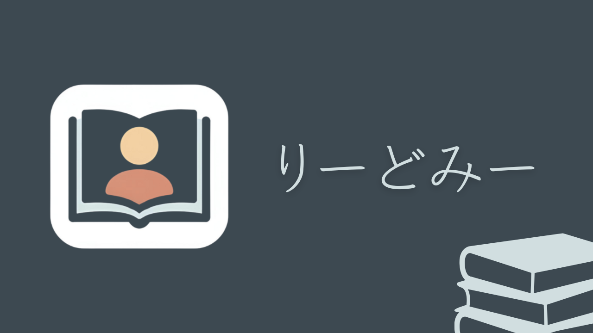

# りーどみー

[

# **製品概要**

## **背景(製品開発のきっかけ、課題等）**

- メンバーの悩みとして、「積読してしまう」があがった。
- その悩みの本質は「積読に対する罪悪感」にあった。
- 積読は悪ではない。
- 「積読」にはその人の課題意識や興味があらわれる。

## **製品説明（具体的な製品の説明）**

### **特長**

**特長 1：本が話しかけてくる**

- AI によって本を擬人化
- プッシュ通知で話かけてくる

**特長 2：どれを読んだらいいか、が常に明確になる**

- アンロック機能による優先順位づけ
- ゲーミフィケーションによって読むのが楽しくなる

**特長 3：**

- カメラで撮影して本を登録

## **解決出来ること**

- 積読の最大の原因は「とりかかるまでの動機がないこと」
- だから「きっかけ」さえあれば本を読むことができる。
- そこで我々は、「本が語りかけてくる」というソリューションを提案。
- 「最初の１歩」をアシストし、積読の罪悪感から解放する。

## **今後の展望**

## **注力したこと（こだわり等）**
